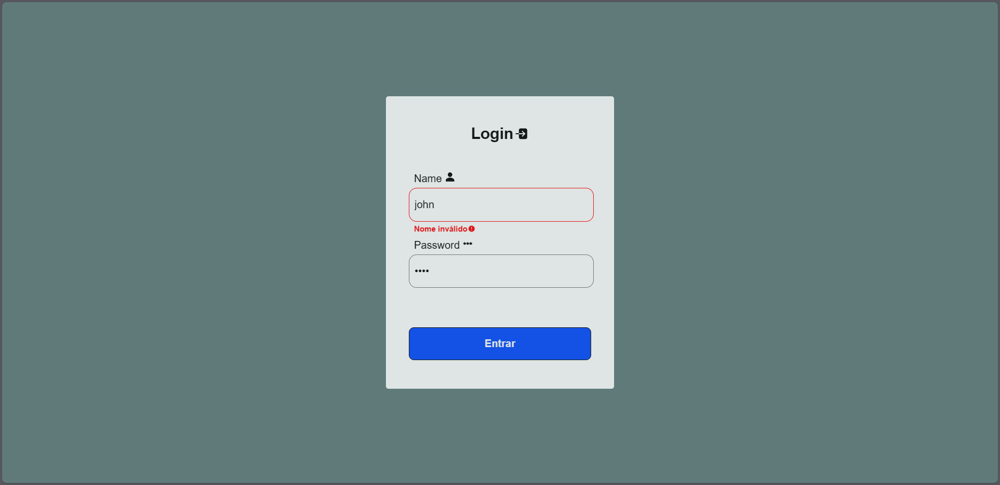

# Inicialização

Project started with [Create React App](https://github.com/facebook/create-react-app).

## Scripts

In the project directory, you can run:

### `npm start`

Runs the app in the development mode.\
Open [http://localhost:3000](http://localhost:3000) to view it in the browser.

The page will reload if you make edits.\
You will also see any lint errors in the console.

## Technologies
- React
- Typescript
- Styled-components

### Libraries
- React-router-dom
- React-icons
- Styled-components

## About
It is a project to improve skills in styled-components, just a basic project.

Firstly, the user will see a page for login, that accept just `admin` as name, and `1234` as password to navigate to other page, but don't have any others content in that page.

# Preview
